# The SJH Dragon Fire Process

**Nobody should have to type "any update?"**

Twelve phases, sixty-nine guided tasks, seventy-two templates and a client
sign-in. Clients watch every phase as it happens. Studios can licence the whole
thing, rebranded as theirs, for **£39**.

**Try it:** [open the guest demo](https://sarahjhill.github.io/project-os/app.html?guest=1)
— the real app, loaded with a fictional project. No sign-up, nothing saved
anywhere but your own browser.

Built and licensed by [Sarah J Hill · Dragon Fire Design](https://sarahjhill.com)
· sarah@sarahjhill.com

---

## The design

The app was already themed entirely from CSS custom properties, which is why
re-skinning it to the Dragon Fire brand took **one file** —
[`css/dragon-fire.css`](css/dragon-fire.css) — and no change to `app.js` at all.
It loads after `styles.css` and overrides the tokens for both light and dark.

Every colour in it was contrast-checked against the surface it actually sits on;
the ratios are written in the comments. The Google Fonts request was removed from
every page at the same time — the app now uses the system stack, which was the
single slowest thing it loaded.

The landing page (`index.html`) shares its stylesheets with sarahjhill.com, so
the studio and the product look like one thing. It scores 100/100/100/100.

---

> ### If you are copying this repository
>
> **`js/config.js` contains live keys for my Supabase project and my Formspree form. Replace both with your own before you use it.**
>
> Left as they are, the app will sign in but show you nothing — the database only returns rows belonging to its owner — and any client form you sent would deliver a stranger's answers to somebody else's inbox.
>
> `supabase/SETUP.md` walks through creating your own, and it is free. If you would rather not bother, the app runs perfectly well with no Supabase at all, storing everything in your browser.

---

## Contents

- [UX](#ux)
- [Colour scheme](#colour-scheme)
- [Typography](#typography)
- [Responsiveness](#responsiveness)
- [User stories](#user-stories)
- [Features](#features)
- [Tools and technologies](#tools-and-technologies)
- [Data model](#data-model)
- [Testing](#testing)
- [Deployment](#deployment)
- [Turning on form submissions](#turning-on-form-submissions)
- [How your data is handled](#how-your-data-is-handled)
- [Making it yours](#making-it-yours)
- [Credits](#credits)

## UX

### 1. Strategy

**Purpose.** There is exactly one job: on any given morning, tell me what to do next and why, without my having to remember or decide. Everything else in the app is in service of that, or it should not be there.

Two audiences use it, and they want opposite things:

- **Me.** Depth. The whole process, all sixty-nine tasks, the guidance, the estimates, the templates, the sprint I am in.
- **The client.** Reassurance. Where the project is, what is happening this week, and what I need from them. Nothing else — a client shown a task board is a client who starts managing it.

That split is why the client view is a separate page (`client.html`) fed by a snapshot I publish deliberately, rather than a filtered version of my own screen. I decide what they see, and I decide when.

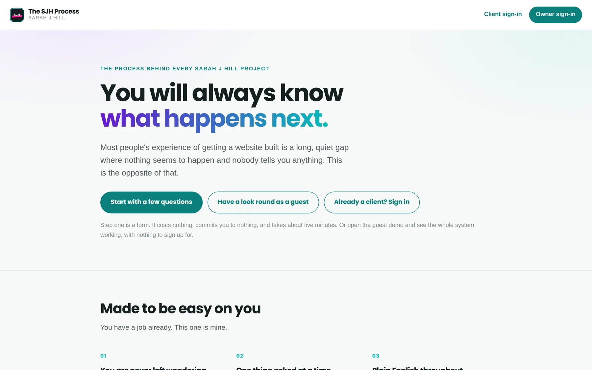

**The honest constraint.** I am the only developer and the only user. That rules out anything needing a server I would have to maintain, a build step I would have to remember, or a subscription I would have to justify. Plain HTML, CSS and JavaScript, deployed as static files.

### 2. Scope

In scope, because I use them every week:

- The full process as structured data, with guidance on every task
- Progress, priority, points, estimates and due dates per task
- A board and a sprint view, because a flat 69-item list is not a plan
- 72 templates, readable in the app and copyable as Markdown
- Six client forms that can be sent as a link, with answers filed back into the task they belong to
- A client-facing progress page I control
- The website audit playbook — the method I use to find work
- Export and import, because localStorage is not a backup

Out of scope, deliberately: time tracking (I use a separate timer), invoicing (my accountant's software does that), multi-user editing, and anything resembling a Gantt chart.

### 3. Structure

The app is one page with nine tabs, and the ordering is the order you need them in a working day:

**Dashboard** answers *how is this going*. **Summary** answers *what am I doing this week*. **Process** is the reference — the whole method, phase by phase. **Board** and **Sprints** are for planning. **Files**, **Templates** and **Audits** are the supporting material. **Clients** is the outward-facing bit.

Guidance lives in a drawer rather than a page, so reading how to do a task never loses your place in the list.

### 4. Skeleton and surface

Data first, chrome second. The dashboard opens with four numbers and a phase-by-phase bar chart, because those answer the question fastest. Cards are quiet — one hairline border, a small radius, no shadow stack — so the only strong colour on screen is progress and status. When everything is styled, nothing stands out.

### Colour scheme

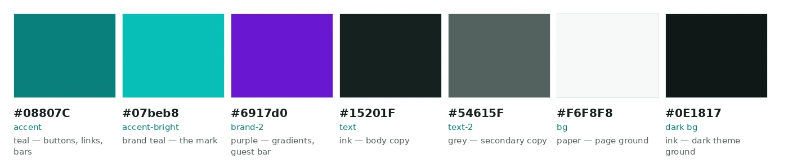

The palette is the Make It Pop brand palette, held back. This is a tool I look at for hours, not a page I am trying to make somebody remember, so the brand colours appear as accents on a near-neutral ground rather than as the ground itself.

- `#08807C` — accent teal. Buttons, links, progress fills. It reaches **4.78:1** on white, which is why it is this and not the brighter brand teal.
- `#07beb8` — brand teal. The mark, and fills that carry no text.
- `#6917d0` — purple. The guest banner gradient and brand moments only.
- `#15201F` / `#54615F` — ink and grey for copy.
- `#F6F8F8` — paper.
- `#0E1817` — the dark theme ground.

Status colours are a separate set (`--ok`, `--warn`, `--danger`, `--info`) so a red on the board always means blocked and never means brand.

**Dark theme.** Both themes are defined as tokens — `:root` for light, `[data-theme="dark"]` for dark — and every component reads the token rather than a literal. The accent switches to `#3FD6D1` in dark, which reaches 9.55:1 on the dark surface. Nothing else in the CSS knows which theme it is in.

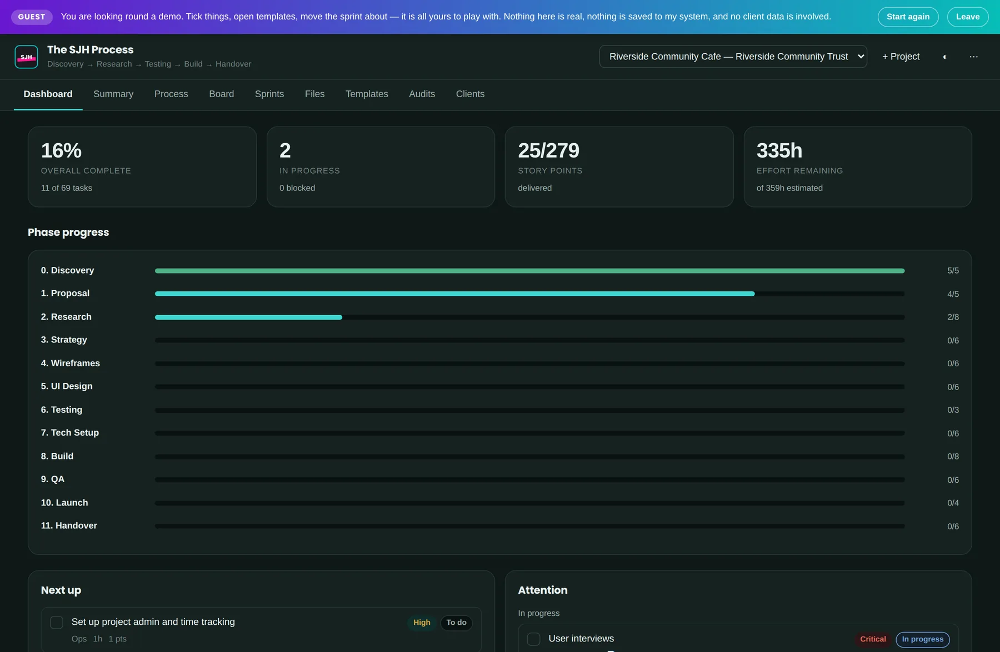

### Typography

- [Display — Poppins](https://fonts.google.com/specimen/Poppins) at 600 and 700, for headings, the wordmark and the big dashboard numbers.
- [Body — Lato](https://fonts.google.com/specimen/Lato) at 400 and 700, which stays readable at the small sizes a dense task list needs.
- Monospace (`ui-monospace`, system stack) for IDs and code — no download, since it is used for a handful of characters.

Two weights of each face, nothing else. The fonts are the only external request the app makes.

## Responsiveness

There is no CSS framework. The layout is Grid and Flexbox with `clamp()` for type, which is enough for an app this shape and saves the visitor a framework download.

Two decisions worth calling out because they are about behaviour rather than layout:

- **The board scrolls horizontally on narrow screens rather than stacking.** Five stacked columns on a phone is a list with extra steps; a scrolling board keeps the shape of the thing you are looking at.
- **The task drawer becomes a full-height sheet under 720px.** Guidance is long-form reading, and a side panel on a phone is a column six words wide.

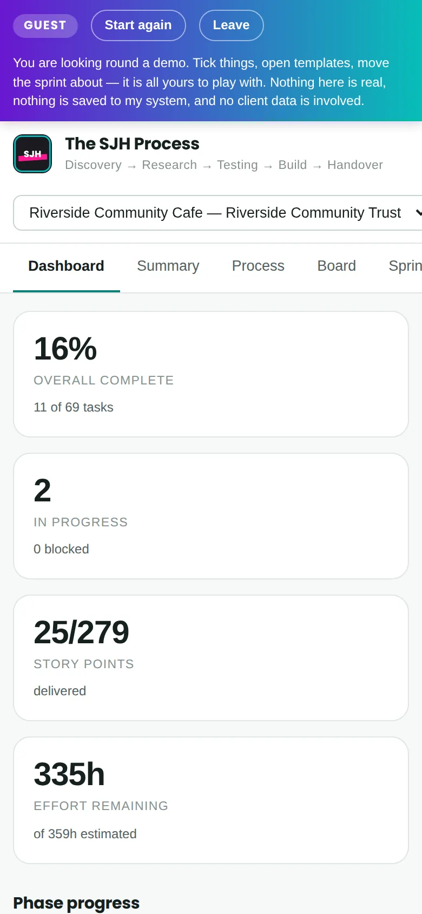
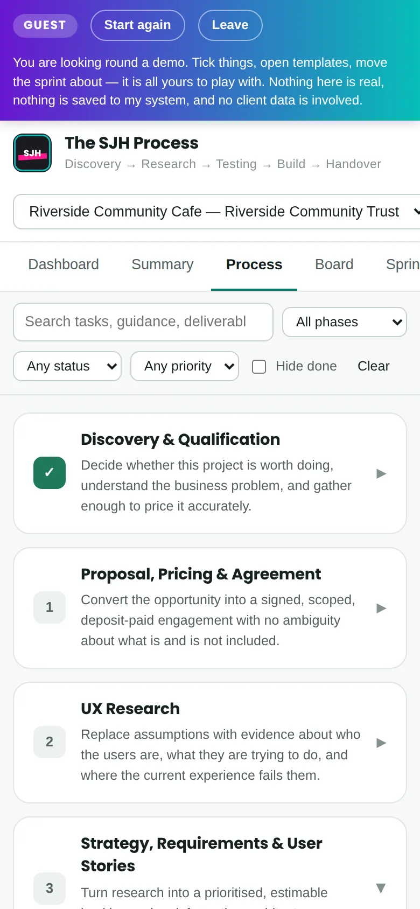

## User stories

**1. Me, on Monday morning**

> As the developer, I want to see what is next without re-reading the whole plan, so that I start work instead of deciding what work to start.

The Summary tab opens on the current sprint, what is left in it, and the next tasks in order. Four numbers and a list.

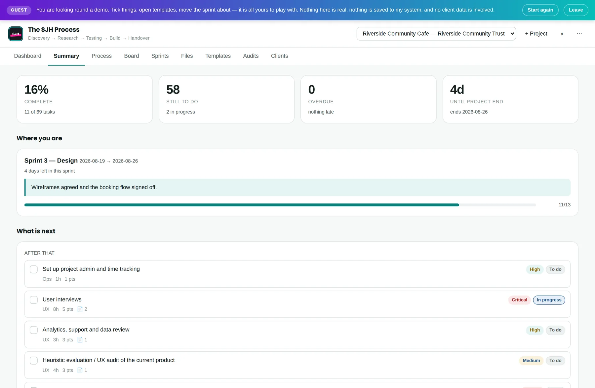

**2. Me, mid-project, about to skip something**

> As the developer, I want to know why a task exists before I decide to skip it, so that I skip the ones that genuinely do not apply and not the ones that are merely dull.

Every task carries a **Why this matters** paragraph. It is there because "run the accessibility pass" is easy to drop at 6pm on a Friday and "this is the thing that gets you sued and it takes forty minutes" is not.

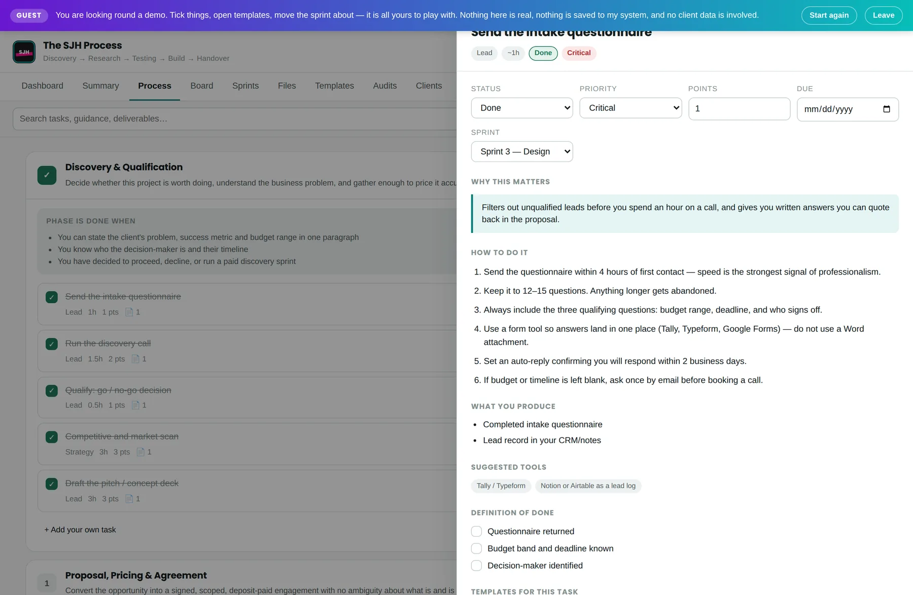

**3. Me, quoting a new project**

> As the developer, I want an estimate built from the actual work, so that I quote from a list rather than a feeling.

Every task has an hour estimate and a story-point value. The dashboard totals both — 359 hours and 279 points for a full client build — and you scope down from a real number.

**4. A client, three weeks in, wondering**

> As a client, I want to see where my project is without having to ask, so that I stop worrying about it.

`client.html` shows a snapshot I publish: progress, the current phase, what I need from them, and recent milestones. They see it when I decide it is worth seeing, which means it is never half-finished or misleading.

**5. A client, asked for content**

> As a client, I want to send information without wrestling with a Word attachment, so that I actually send it.

Six of the templates are sendable forms at their own URLs. The client gets a link, fills it in on a phone if they like, and presses send. The answers arrive in my inbox and file themselves against the task that asked for them.

**6. Me, looking for work**

> As the developer, I want a repeatable way to find businesses I can genuinely help, so that finding work is a process rather than a mood.

The Audits tab holds the website audit playbook: nine steps from building a target list to making contact with evidence attached.

## Features

**The process, as data** — 12 phases and 69 tasks, each with the reasoning, numbered steps, deliverables, suggested tools, and a definition of done you tick off. Phases carry their own exit conditions, so "done" is a stated condition rather than a feeling.

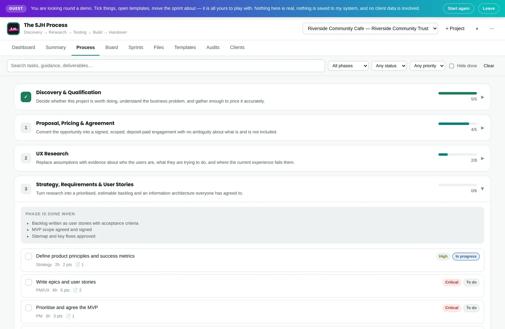

**Two tracks** — client work and my own growth work are not the same job, and pretending otherwise meant either following a twelve-phase client process to write a blog post, or working with no process at all. Choosing the track is now part of creating a project: **Client website** gives you the 12-phase process, **Growth & marketing** gives you a 5-phase one covering SEO groundwork, directory listings, and the habits that keep a site visible. Everything downstream — the dashboard, the board, the phase filter, the strapline under the title — follows the track the project is on. Projects created before tracks existed keep working untouched; anything without a track is treated as client work.

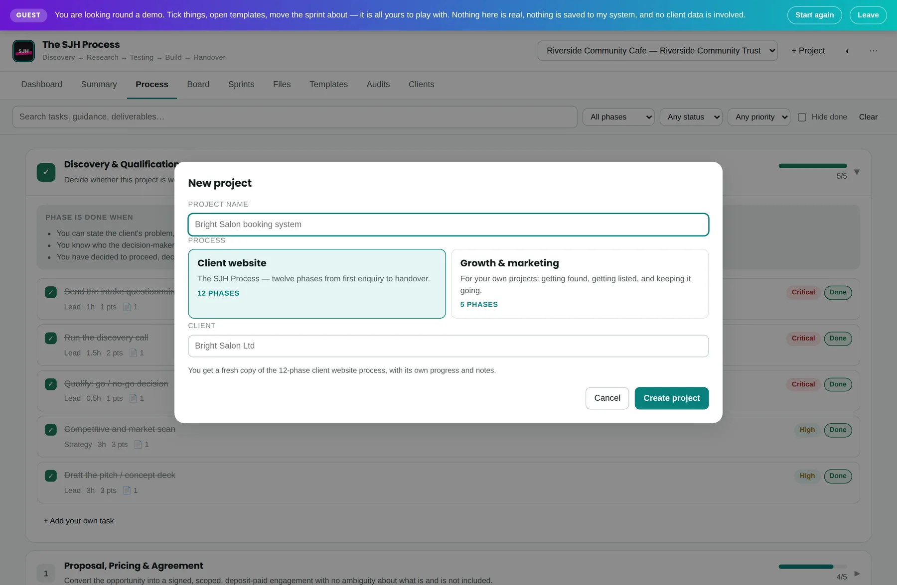

**The dashboard** — four numbers, then progress by phase, then what is next and what needs attention. It is the first screen because it answers the first question.

**The board** — the same 69 tasks as five status columns, filterable by phase, priority and status, searchable across titles, guidance and deliverables.

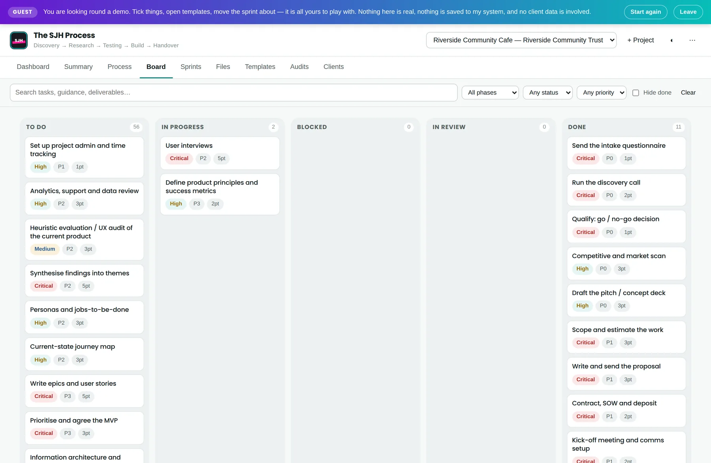

**Sprints** — fixed-length, capacity in points, and an honest **over capacity** warning when you have committed to more than you said you could do. The warning is the entire feature; a sprint you can silently overfill is a to-do list with dates.

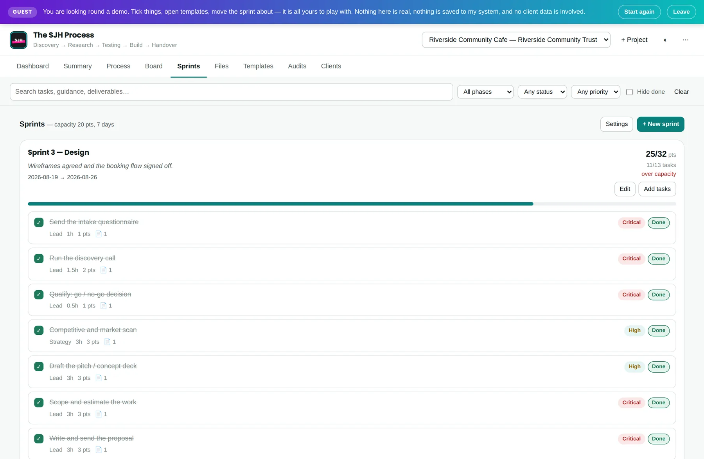

**72 templates** — proposals, statements of work, research plans, test scripts, handover documents. Readable in the app, copyable as Markdown, and attached to the tasks that need them, so the template appears at the moment you need it rather than in a folder you have to remember.

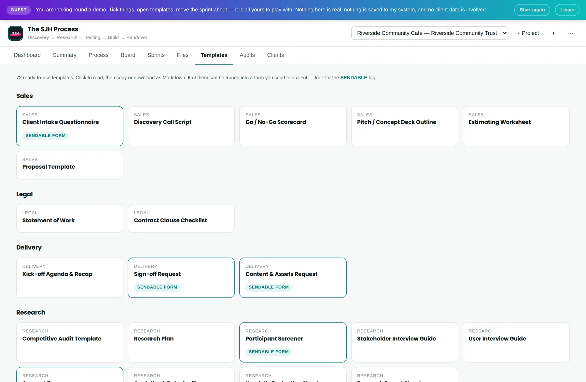

**Six sendable client forms** — intake, research screener, content and assets, review and sign-off, consent, and audit. Each one is a real page at its own URL, so a client gets a link rather than an attachment. If Formspree is configured they submit directly; if not, the form downloads a file they can email back. Either route ends in the same place, filed against the task that asked the question.

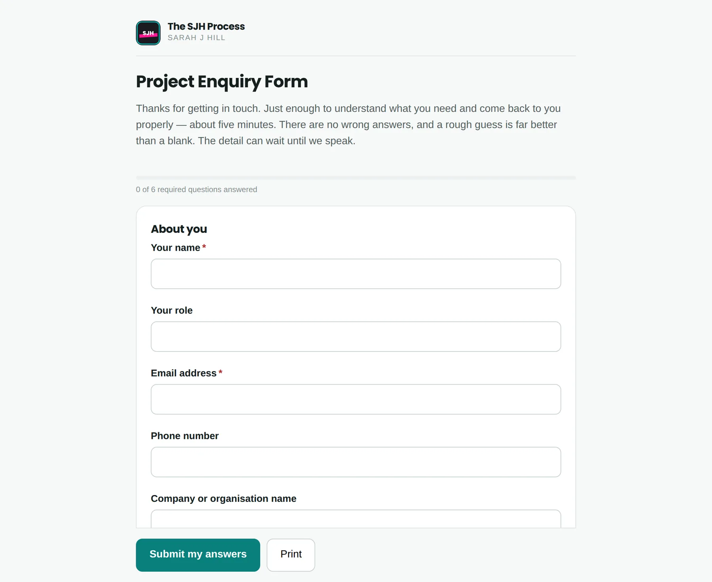

**The website audit playbook** — nine steps and a ten-check automated scan, plus four target sectors worth working. Its governing rule is written into the page: never put a number in front of someone you cannot show your working for. A measured load time beats a confident guess, and it is the reason the email gets answered.

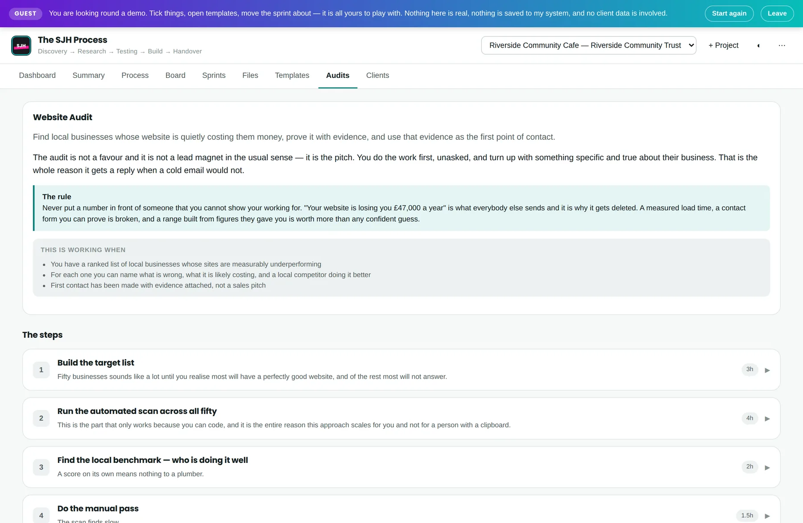

**File attachments** — files attach to tasks and live in IndexedDB, so a signed contract sits on the task that produced it rather than in a downloads folder.

**Client sharing** — invite a client, choose which sections they see, publish an update. Accounts and the published snapshot live in Supabase behind row-level security. Without Supabase configured the tab says so plainly and everything else keeps working.

**Guest mode** — `?guest=1` opens the whole app on a fictional project. It empties the Supabase config so no connection is opened, points the store at a separate localStorage key so it cannot touch real projects on a shared machine, and empties the Formspree endpoint so a curious guest filling in a form does not reach my inbox.

**Offline and installable** — a service worker caches the app, and a web manifest lets it install to a dock or home screen.

### Future features

- **Enquiry to project** — an enquiry from [Make It Pop](https://sarahjhill.com) creating its project automatically.
- **Actual against estimate** — every task already carries an estimate; recording what it really took would make the next quote better.
- **A third track** — a shorter maintenance-and-retainer process, which is currently the client process with most of it skipped.
- **Supabase sync for my own data**, not just the client snapshot, so the laptop and the desktop agree.

## Tools and technologies

| Tool / Tech | Use |
| --- | --- |
| HTML5 | Semantic structure across 11 pages |
| CSS3 | Custom properties, Grid, Flexbox, `clamp()`, two themes |
| JavaScript (ES5-compatible) | The entire app — no framework, no build step |
| [Supabase](https://supabase.com) | Client accounts and published snapshots, behind row-level security |
| [Formspree](https://formspree.io) | Client form delivery |
| localStorage | Projects, tasks, sprints, notes |
| IndexedDB | File attachments |
| Service Worker | Offline support |
| [Google Fonts](https://fonts.google.com) | Poppins and Lato |
| [html-validate](https://html-validate.org) | HTML validation |
| GitHub Pages | Hosting |
| GitHub Actions | Deployment on push to `main` |

**No build step and no dependencies.** Nothing is compiled, bundled or installed. Every file in this repository is served exactly as it is written, which means it can be read, edited in the browser on GitHub, and debugged without a source map. The only runtime import is the Supabase client, loaded from a CDN and only when cloud features are actually configured.

## Data model

A project is one object. Its `tasks` map holds only what has *changed* from the process definition — status, priority, points, sprint, due date, notes, ticked definition-of-done items — keyed by task id. The definitions themselves live in `js/data-phases*.js` and are never copied into a project.

```js
{
  id: 'proj_…',
  name: 'Riverside Community Cafe',
  client: 'Riverside Community Trust',
  track: 'client',          // which process this project follows
  sprintLength: 7,
  capacity: 20,
  tasks: { 'p0-1': { status: 'done', pts: 1, sprint: 'spr_…' } },
  custom: [ /* task definitions you added yourself */ ],
  sprints: [ … ],
  docNotes: { … }
}
```

Two consequences that shaped the code. Editing a task's guidance improves it for every project at once, past ones included, because nothing was copied. And a task the process does not define — one of your own — is carried in `custom` and merged in at read time, which is why `Store.allTasks()` is a function rather than an array.

`track` is the newest field and the only one allowed to be absent: `window.trackFor()` returns the client track for anything it does not recognise, so a project saved before tracks existed loads exactly as it did before.

## Testing

### HTML validation

Validated with [html-validate](https://html-validate.org) against the recommended ruleset, across all 11 pages — the landing page, the app, the client view, the 404, and the seven form pages.

The first run reported **56 problems**. Not all of them were bugs, and separating those is most of the value of running a validator:

| Issue | Count | Outcome |
| --- | --- | --- |
| `<button>` without an explicit `type` | 24 | **Fixed.** A `<button>` inside a form defaults to `submit`, so a control meant to toggle a panel can submit the form instead. |
| Raw `&` in text content | 2 | **Fixed.** Encoded as `&amp;`. |
| Duplicate form control name | 20 | **Rule configured.** Checkbox groups are *supposed* to share a name — that is how a multi-select checkbox group works. `form-dup-name` is set to allow shared names for radio and checkbox, which is its documented option for exactly this case. |
| Inline style not allowed | 10 | **Rule disabled.** A house-style preference, not a validity error. The instances are runtime toggles (`style="display:none"`), which belong in the markup. |

Configuration lives in `.htmlvalidate.json`, so the reasoning is in the repository rather than in somebody's memory. All 11 pages now pass with **0 errors and 0 warnings**:

```
$ npx html-validate index.html app.html client.html 404.html forms/*.html
$ echo $?
0
```

The deployed pages can also be checked against the W3C service: [validator.w3.org](https://validator.w3.org/nu/?doc=https%3A%2F%2Fsarahjhill.github.io%2Fproject-os%2F).

### CSS validation

Run against the [W3C CSS validator](https://jigsaw.w3.org/css-validator/validator?uri=https%3A%2F%2Fsarahjhill.github.io%2Fproject-os%2F).

### Browser testing

Rendered and driven with Playwright against Chromium at 1440×940, 1280×1000 and 390×844, with the console watched for errors throughout.

| Test | Result |
| --- | --- |
| App boots with no console errors | Pass |
| All nine tabs render on a client project | Pass |
| All nine tabs render on a growth project | Pass |
| A new client project loads 12 phases and 69 tasks | Pass |
| A new growth project loads 5 phases and 13 tasks | Pass |
| The phase filter rebuilds when you switch project | Pass |
| A project saved before tracks existed still loads 12 phases | Pass |
| Task drawer shows guidance, deliverables and definition of done | Pass |
| Progress survives a reload | Pass |
| Export produces a file that imports cleanly | Pass |
| Guest mode opens no Supabase connection | Pass |
| Layout holds from 320px to 1920px | Pass |

The seventh row is the one that mattered. Adding tracks meant every phase lookup had to become project-aware, and the failure mode is silent — a project would simply show the wrong process rather than throwing. It is tested by loading a project with no `track` field at all and asserting it still resolves to the twelve-phase one.

The sixth row is a bug this testing found. The phase filter was built once at boot, so after switching to a growth project the dropdown still offered the client phases. It now rebuilds on every project change, and the stale filter is cleared, since a phase id from one track does not exist in the other.

### Accessibility

- Every interactive element is reachable and operable by keyboard; the task drawer traps focus while open and returns it on close.
- Colour contrast meets WCAG AA in both themes. The bright brand teal is deliberately swapped for a darker variant anywhere it has to be read.
- Status is never carried by colour alone — every pill carries its word.
- Form controls all have associated labels; icon-only buttons carry `title` and accessible names.
- The dark theme is a genuine second design rather than an inversion, and each token was checked against its own ground.

## Deployment

### GitHub Pages

Five minutes, no command line needed.

**1. Create the repository.** Go to [github.com/new](https://github.com/new). Name it `project-os`, make it **Public** (GitHub Pages requires this on the free plan), and leave **Add a README**, **.gitignore** and **licence** unticked — this folder already has them.

**2. Upload the files.** On the **Quick setup** page, ignore the git commands and click the **uploading an existing file** link below them. Select everything inside this folder — `index.html`, `app.html`, `client.html`, `README.md`, `LICENSE`, and the `css`, `js`, `forms`, `supabase` and `.github` folders — and drag it in. Scroll down and **Commit changes**.

> **The `.github` folder may be invisible.** Files starting with a dot are hidden by default. On macOS press **⌘-Shift-.** in Finder; on Windows, View → Show → Hidden items. If you would rather not bother, skip it and use 3b below. Drag in `.nojekyll` too if you can see it — an empty file that stops GitHub processing the site as a blog.

**3a. Turn on Pages (with the workflow).** Settings → Pages → Build and deployment → **Source: GitHub Actions**. The included workflow deploys on every push to `main`.

**3b. Turn on Pages (without it).** Settings → Pages → Source: **Deploy from a branch** → Branch `main`, folder `/ (root)` → Save.

**4. Wait a minute.** The site appears at `https://YOUR-USERNAME.github.io/project-os/`. The first build is the slow one; if you get a 404, wait two minutes and refresh, and check the Pages source setting saved.

**Updating later.** Edit files on GitHub directly or upload replacements; Pages redeploys automatically. **Then bump `CACHE` in `sw.js`** (`project-os-v1` → `project-os-v2`). The service worker caches aggressively for offline use, and without a version bump returning visitors keep the old files.

### Local development

**Cloning.** On the [repository page](https://www.github.com/sarahjhill/project-os), click **Code** → copy the HTTPS URL, then:

```bash
git clone https://github.com/sarahjhill/project-os.git
cd project-os
python3 -m http.server 8000
```

Open `http://localhost:8000`. A server is needed rather than opening the file directly, because the service worker and module imports will not run from `file://`.

**Forking.** Click **Fork** at the top right of the repository page. Note the licence below before you do.

**Local versus deployed.** The local copy and the deployed copy are separate browser storage and share nothing. Move work between them with **⋯ → Export backup** and **Import**.

## Turning on form submissions

Without this, client forms still work — they download a file the client emails back. With it, the client presses **Submit my answers** and it lands in your inbox.

**1. Get an endpoint.** Sign up free at [formspree.io](https://formspree.io) → New Project → New Form. Copy the endpoint; it looks like `https://formspree.io/f/xyzabcde`.

**2. Paste it into `js/config.js`:**

```js
formspreeEndpoint: 'https://formspree.io/f/xyzabcde',
appUrl: 'https://YOUR-USERNAME.github.io/project-os/',
```

Commit, then bump `CACHE` in `sw.js`.

**3. Send yourself a test.** **Formspree emails a confirmation link the first time — click it, or nothing else comes through.** This catches out almost everyone.

While you are in `config.js`, edit the `thankYou` block — that is what the client sees after submitting.

**What the client sees, and what you get.** They see your thank-you message. You get an email with every answer in readable form, plus **➤ FILE THESE ANSWERS (click)**, which opens the app and files the answers under the task that asked for them, and a **PROJECT OS DATA** block to paste manually for the times an email client mangles the link. Either way: Phase 0 → *Send the intake questionnaire* → **Client responses** → **Read answers**.

Worth knowing: the free tier is 50 submissions a month; your endpoint is visible in a public repo, which is normal and by design (the worst case is spam, which Formspree filters); and client data passes through Formspree, so mention them in your privacy policy if you handle anything sensitive.

## How your data is handled

Everything stays in **your** browser unless you deliberately publish it. No analytics, no tracking, no third-party scripts.

| Data | Where it lives |
| --- | --- |
| Task progress, notes, sprints, links | `localStorage` |
| Files attached to tasks | `IndexedDB` |
| Client accounts and published snapshots | Supabase, behind row-level security |
| Client form answers | Emailed to you via Formspree, or downloaded by the client |

Two consequences worth understanding:

1. **The site is public, but your data is not.** Anyone can open the URL and get an empty copy. What you type into yours never leaves your machine unless you publish it to a client.
2. **Clearing your browser data deletes your work.** Use **⋯ → Export backup** regularly. It is the only backup that exists.

## Making it yours

The process is data, not code — edit it freely.

| To change | Edit |
| --- | --- |
| The client process | `js/data-phases.js` (phases 0–5), `js/data-phases-2.js` (6–11) |
| The growth process | `js/data-phases-growth.js` |
| Which processes exist | `js/data-tracks.js` |
| Templates | `js/data-docs.js`, `js/data-docs-2.js` |
| Form questions | `js/data-forms.js` |
| The audit playbook | `js/data-audit.js` |
| Colours, type, spacing | the `:root` block in `css/styles.css` |

A task looks like this — add your own by copying the shape:

```js
{
  id: 'p2-9', title: 'Run a diary study', role: 'UX', est: 6, pri: 3, pts: 5,
  why: 'Interviews capture what people remember. Diaries capture what actually happened.',
  how: ['Recruit 6 participants…', 'Prompt daily for two weeks…'],
  deliver: ['Diary entries', 'Behaviour timeline'],
  tools: ['Google Forms'],
  dod: ['6 participants completed 10+ days'],
  docs: ['doc-research-plan']
}
```

**Adding a whole new process** takes a data file and one entry. Write `js/data-phases-yours.js` exporting `window.PHASES_YOURS` in the same shape, load it in `app.html` before `data-tracks.js`, and add it to `window.TRACKS`. It then appears in the new-project dialog and everything else follows automatically — that is the entire reason phase lookups go through `Store.phases()` rather than reading a global.

After editing form questions, regenerate the pages in `forms/` — or delete that folder and use **Create client form** in the app to email files instead. **Before sending the research screener to anyone**, replace the placeholder competitor names (Option A, B, C) in `js/data-forms.js`.

### Repository layout

```
index.html               landing page
app.html                 the app
client.html              what a client sees
css/
  styles.css             design tokens and all app styling
  landing.css            landing page only
js/
  data-phases.js         client process, phases 0–5
  data-phases-2.js       client process, phases 6–11
  data-phases-growth.js  growth process, 5 phases
  data-tracks.js         the track registry
  data-docs.js           templates: sales, legal, research, strategy, backend
  data-docs-2.js         templates: design, dev, agile, QA, launch, handover
  data-forms.js          the six sendable form definitions
  data-audit.js          the website audit playbook
  store.js               state, storage, import/export
  app.js                 views, task drawer, board, sprints, markdown renderer
  clients-ui.js          client sharing (owner side)
  cloud.js               Supabase client, loaded only when configured
  gate.js                sign-in gate
  guest.js               guest mode
  forms.js               form generator and answer parser
  config.js              your keys — replace these
forms/                   pre-built form pages, shareable by link
supabase/SETUP.md        setting up your own database
sw.js                    service worker (offline)
.htmlvalidate.json       validation config, with reasoning
```

## Browser support

Chrome, Edge, Safari and Firefox, current versions, desktop and mobile. File attachments need IndexedDB, which private and incognito windows restrict — the app says so if that happens and keeps working for everything else.

## Credits

### Content

The process, the 69 tasks, the 72 templates, the six forms and the audit playbook are my own work, written from projects I have delivered. Where they reflect established practice — Agile ceremonies, WCAG criteria, the standard shape of a statement of work — that practice is the industry's and not mine; the wording, sequencing and reasoning are.

### Media

All screenshots in `documentation/images/` were captured from the running application. The demo project shown in them ("Riverside Community Cafe") is fictional and contains no client data.

### Acknowledgements

- [Supabase](https://supabase.com) and [Formspree](https://formspree.io), whose free tiers make a serverless tool like this genuinely workable for a business of one.
- [html-validate](https://html-validate.org), for catching 26 real problems I could not see.
- Every client who has asked "how is it going?" — that question is the reason `client.html` exists.

## Licence

**Copyright © 2026 Sarah Hill, trading as Sarah J Hill. All rights reserved.** See [LICENSE](LICENSE).

Read it, run it locally, learn from it — that is why the repository is public. It may not be copied, redistributed, sold, offered as a service, or used commercially without my written permission.

If you are a charity, a community group, or someone learning, just ask: sarah@sarahjhill.com. The answer will very likely be yes.

*(This repository was MIT-licensed until August 2026. That grant still applies to copies taken while it stood — it cannot be withdrawn — but not to anything published since.)*
